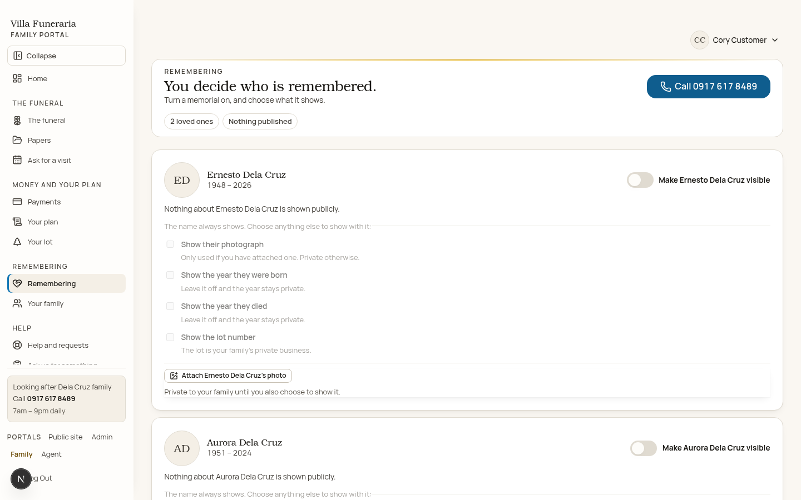
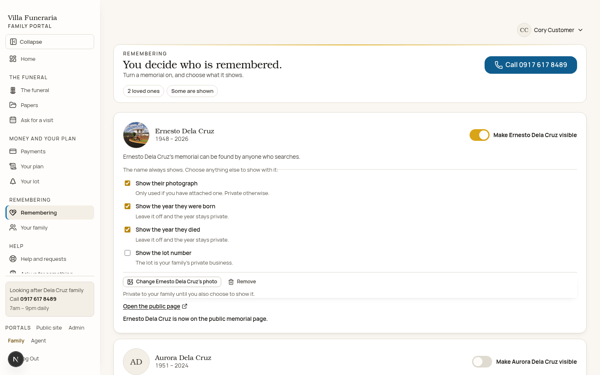
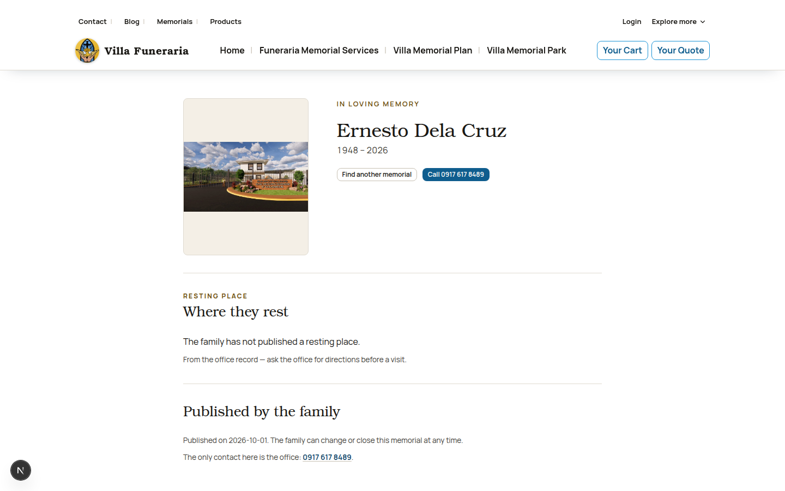
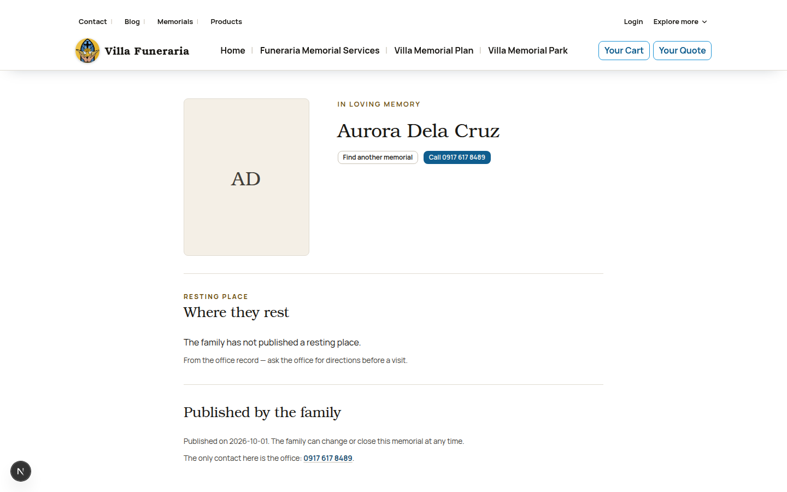
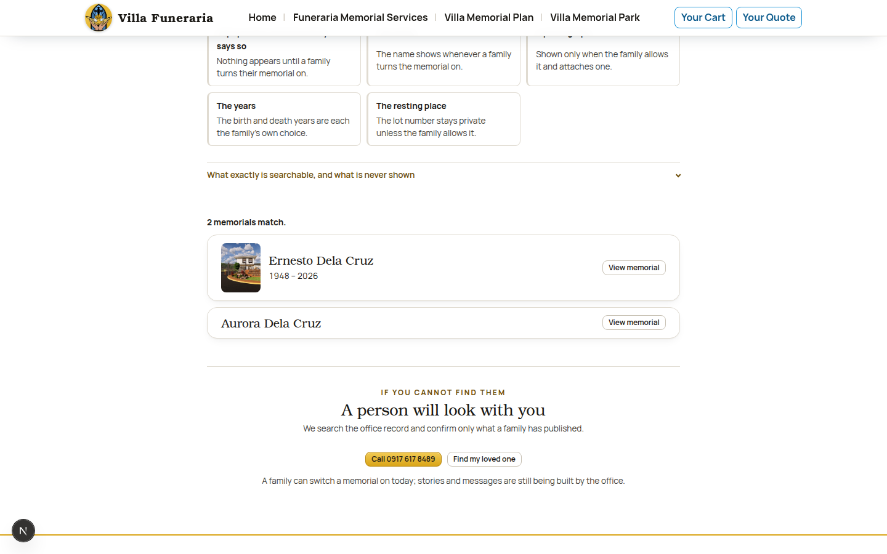
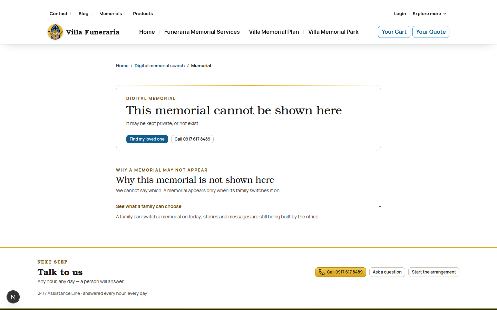

# Memorial visibility — one switch per loved one (2026-09-30)

Captain's intent: *“It should be just this simple, a toggle button on and off saying
that, make Ernesto Dela Cruz visible, or Make Aurora Dela Cruz visible in the
memorials page, and in the memorial page it shouldn't require the born and died,
just the name is enough and people searching can see the name and profile image
and the day he was born and died, this is also configurable for family members if
they don't want to include profile image or the he died, his lot no. etc…”*

## What changed

The three-question “private · family · published” model is gone. Each loved one now
has **ONE switch**, labelled with their name (`Make Ernesto Dela Cruz visible`),
and beside it the four fields the family may show:

| Field | Default | Shown when |
|---|---|---|
| The name | shown whenever the switch is on | — (never optional) |
| The photograph | OFF | the switch is on **and** the family allows it **and** a picture is attached |
| The birth year | OFF | the switch is on **and** the family allows it |
| The death year | OFF | the switch is on **and** the family allows it |
| The lot number | OFF | the switch is on **and** the family allows it |

A published memorial with the name alone is a complete page — no birth or death
date is ever demanded, and the page never prints a field the family did not give.
Hiding a year also makes it unsearchable (`matchMemorials` reads the built record),
so a hidden date cannot leak through the search.

## Where it lives

| Concern | File |
|---|---|
| The consent model, field vocabulary, life-date helpers, search | `lib/memorials.ts` |
| The durable consent store (append-only journal) | `lib/api-client/memorial-store.ts` |
| The public reader — the switch is the gate | `lib/api-client/memorials.ts` |
| The seed (every consent off) | `lib/fixtures/memorials/memorials.json` |
| The family write route | `app/api/family/memorials/route.ts` |
| The family switch UI | `components/family/memorial-visibility.tsx` |
| The family screen | `app/(family)/client/memorials/page.tsx` |
| The published portrait route | `app/api/memorials/[id]/photo/route.ts` |
| Per-loved-one private portraits | `lib/family-image-store.ts`, `app/api/family/images/*` |
| Public pages | `app/(public)/memorials/{page,[id]/page,[id]/memorial-profile,find/page,memorial-choices}.tsx` |
| Styles | `styles/components.css` (`family: memorial visibility` block) |

The store path is `MEMORIAL_STORE_PATH` when set, else `.data/family-memorials.json`
(gitignored). The switch writes this record; the public pages read it, so turning a
switch on makes the memorial appear on the next request and turning it off removes
it.

## The printed record the switch writes

After switching Ernesto on and choosing the photograph, the birth year and the
death year, `.data/family-memorials.json` reads:

```json
{
  "version": 1,
  "events": [
    {
      "kind": "consent_saved",
      "at": "2026-10-01T13:24:33.958Z",
      "actor": "customer@vm.demo",
      "record": {
        "person_id": "ernesto-dela-cruz",
        "owner_user_id": "00000000-0000-4000-8000-000000000014",
        "updated_at": "2026-10-01T13:24:33.958Z",
        "visible": true,
        "show_photo": true,
        "show_birth": true,
        "show_death": true,
        "show_lot": false
      }
    }
  ]
}
```

Aurora's own switch wrote a second `consent_saved` event for
`aurora-dela-cruz` with every field `false` — she is a name-only memorial.

## Evidence (1440 and 390)

| File | Shows |
|---|---|
| `family-memorials-1440-off.png` · `family-memorials-390-off.png` | AFTER, switch OFF: one named switch per loved one, “Nothing about … is shown publicly.”, every field disabled and OFF, the four meanings visible |
| `family-memorials-1440-on.png` · `family-memorials-390-on.png` | AFTER, switch ON: photo attached, photograph + birth + death chosen, lot left off, “Ernesto Dela Cruz is now on the public memorial page.” and the public link |
| `public-memorial-1440-photo-dates.png` · `public-memorial-390-photo-dates.png` | the published page with the photograph and `1948 – 2026`; the lot is NOT shown (it was not chosen) |
| `public-memorial-1440-name-only.png` · `public-memorial-390-name-only.png` | the name-only memorial: name + initials, no dates, no photo, no invented resting place |
| `public-search-1440-two.png` | the search: Ernesto with photo and years, Aurora with the name only — no lot in either result |
| `public-search-1440-after-off.png` | AFTER switching Aurora off: one match, her name is gone from the search |
| `public-memorial-1440-aurora-hidden.png` | AFTER switching Aurora off: her URL answers the uniform “This memorial cannot be shown here” page and never prints her name |

The screenshots were taken against a dev server on **:4001** (the captain's :4000
was never touched).

### Screenshots








## Verification

```
npm test        # 260 files, 2910 tests passed
npm run lint    # 0 errors (3 pre-existing warnings in tests/unit/gallery-page.test.tsx)
npm run typecheck
npm run build   # production build passed; /api/family/memorials and
                # /api/memorials/[id]/photo are in the route table
node scripts/smoke-public-routes.mjs --base http://localhost:4001
                # All 54 advertised routes render (production build on :4001,
                # an empty consent store — the captain's :4000 was never touched)
```

`tests/unit/family-memorial-visibility.test.tsx` is the end-to-end proof: a POST
through the family route writes the record the public reader reads, the name-only
memorial is complete, the lot stays private unless chosen, turning the switch off
removes the memorial, and the portrait route 404s until both the switch and the
photograph are on. `tests/unit/memorials.test.ts` pins the pure rules, and
`tests/fixture-contract/memorials.test.ts` pins the empty seed.

## Open items

- The office's own memorial service (stories, messages, moderation) is still being
  built; the family page says so in its one honest gap line and keeps the office
  number as the way to ask for what is genuinely missing.
- The platform contract for a digital-memorial read/write endpoint is still
  unbuilt (`lib/live-mode.ts` keeps `memorials` in state `none`), so the consent
  store is fixture-mode only, exactly as `lib/fixtures/memorials/memorials.json`
  records.
- The client's public memorial search/privacy rules remain an open question
  (`docs/07-client-villa/open-questions.md`); the pages publish the guaranteed
  floor and never assume an answer.
